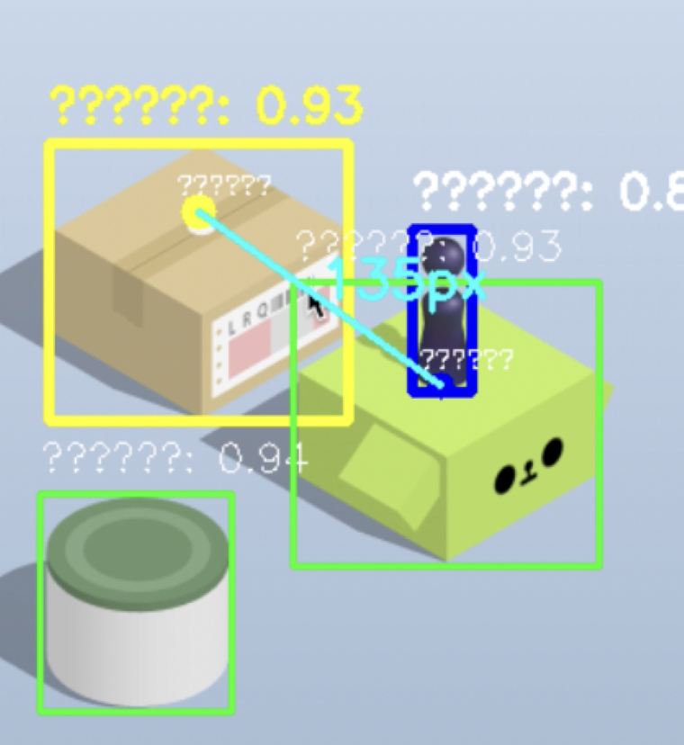

# 跳一跳终结者

基于YOLO深度学习框架的微信跳一跳自动游戏AI系统，集成了先进的计算机视觉技术、实时推理能力和自监督学习机制，实现完全自主的游戏自动化。



## 快速开始指南

⚠️注意！你可以进入“Ready-To-Use“ 目录，遵循其中的 README.md 来**更便捷**地开始运行项目！⚠️

### 环境要求
- Python 3.8 或更高版本
- macOS 或 Windows 操作系统
- 屏幕录制权限（macOS 需要在系统偏好设置中授权）

### 安装步骤
```bash
# 克隆仓库（如果从GitHub获取）
git clone <repository-url>
cd jump_jump_ai

# 安装依赖
pip install -r requirements.txt
```

### 使用说明
1. **启动应用程序**：
   ```bash
   cd src
   python jump_jump_ai_player.py
   ```

2. **配置游戏区域**：点击"鼠标选择区域"按钮，通过点击 **两个对角点** 来定义游戏屏幕边界

3. **优化参数设置**：将跳跃因子设置为 **0.00404**（经验证的最优值），调整检测置信度至 0.6-0.8

4. **激活AI模式**：点击"开始AI游戏"按钮开始自主游戏

5. **性能监控**：观察实时统计数据，包括跳跃次数、距离计算和检测精度

目前使用 YOLO V8small 模型，在约400张标注数据集上训练92轮，精度达到了接近100%

## 核心功能

### 先进计算机视觉管道
- **实时目标检测**：利用YOLOv8架构同时进行人物和平台检测
- **双类别分类**：区分玩家角色（小人）和目标平台（方块）
- **亚像素精度**：实现精确的边界框回归以优化跳跃轨迹计算
- **多线程架构**：将检测管道与游戏控制分离，确保性能一致性

### 自主游戏智能
- **基于物理的计算**：采用验证的跳跃因子 0.00404 实现最优距离-时长映射
- **自适应目标选择**：自动选择最上方平台作为下一跳跃目标
- **时间稳定化**：实施帧稳定期确保精确测量
- **错误恢复**：内置机制处理检测失败和边界情况

### 自监督学习系统
- **自动数据生成**：实时捕获和标注游戏截图
- **YOLO格式兼容**：生成标准YOLO标注格式训练数据
- **持续学习**：通过自主数据收集实现迭代模型改进
- **质量保证**：基于置信度的过滤确保高质量训练样本

## 技术架构

### 模型性能指标
系统使用基于458张标注图像训练的YOLOv8 Small模型（epoch92.pt）：

| 指标 | 数值 | 分类 |
|------|------|------|
| mAP@0.5 | 99.3% | 优秀 |
| mAP@0.5:0.95 | 87.2% | 优秀 |
| 精确率 | 98.3% | 高 |
| 召回率 | 98.0% | 高 |
| 推理速度 | ~17 FPS | 实时能力 |

### 分类特定性能
- **玩家角色检测**：精确率 100%，召回率 98.6%
- **平台检测**：精确率 96.6%，召回率 97.5%

### 系统要求
- **硬件**：兼容 Apple M3 Pro（已测试）、Intel/AMD 处理器
- **内存**：最低 4GB RAM，推荐 8GB
- **存储**：核心应用约 100MB，数据生成需要额外空间
- **GPU**：可选的 CUDA 兼容 GPU 用于增强性能

## 项目结构

```
jump_jump_ai/
├── src/                          # 源代码目录
│   ├── jump_jump_ai_player.py    # 主应用程序入口
│   ├── realtime_detector_v2.py   # 实时检测引擎
│   ├── train_yolo.py             # 模型训练管道
│   ├── test_model.py             # 模型评估工具
│   └── tools/                    # 开发和实用工具
│       ├── data_collector.py     # 数据采集界面
│       ├── data_labeler.py       # GUI标注工具
│       ├── prepare_dataset.py    # 数据集预处理管道
│       ├── 启动数据采集.py        # 数据收集快速启动脚本
│       └── 启动数据标注.py        # 标注快速启动脚本
├── assets/                       # 资源文件和配置
│   ├── models/                   # 预训练模型权重
│   │   ├── epoch92.pt           # YOLOv8 Small模型（推荐）
│   │   └── yolov8n_best.pt      # YOLOv8 Nano模型（轻量级替代）
│   └── config/                   # 配置文件
│       └── jump_jump.yaml       # YOLO训练配置
├── datasets/                     # 训练和验证数据集
│   ├── manual/                   # 手动标注数据（102个样本）
│   └── auto/                     # 自动生成数据（356个样本）
├── docs/                         # 文档和版本历史
│   ├── VERSIONS.md              # 详细版本变更日志
│   └── 使用说明.md               # 综合用户指南
└── Ready-To-Use-此文件夹下直接运行项目/    # 独立可执行版本
```

## 高级配置

### 模型训练管道
```bash
# 使用当前数据集训练自定义模型
cd src
python train_yolo.py
```

### 模型评估和基准测试
```bash
# 在验证集上评估模型性能
cd src  
python test_model.py
```

### 数据集管理
- **手动标注**：使用 `src/tools/启动数据标注.py` 进行手动数据标注
- **自动收集**：通过主界面启用游戏内数据生成
- **数据集统计**：458张图片总计（102张手动 + 356张自动生成）

## 性能优化

### 推荐参数
- **跳跃因子**：0.00404（实验验证的最优值）
- **检测置信度**：0.6-0.8（精度和敏感度之间的平衡）
- **跳跃间隔**：1.5-2.0秒（允许游戏状态稳定）
- **稳定化周期**：2.0秒（确保精确测量）

### 硬件优化
- **CPU模式**：适用于实时游戏（Apple M3 Pro上17 FPS）
- **GPU加速**：可选的CUDA支持增强训练性能
- **内存管理**：优化队列系统防止扩展会话期间的内存溢出

## 技术实现细节

### 计算机视觉管道
1. **帧捕获**：使用MSS库进行高性能屏幕捕获
2. **预处理**：图像归一化和调整至640×640像素
3. **推理**：YOLOv8模型推理与NMS后处理
4. **坐标变换**：从归一化坐标转换为像素坐标
5. **物理计算**：基于距离的跳跃持续时间计算

### 游戏控制系统
1. **目标选择**：自动选择最优跳跃目标
2. **轨迹计算**：基于物理的跳跃力确定
3. **执行时机**：精确鼠标按压持续时间控制
4. **状态管理**：游戏状态跟踪和恢复机制

### 数据生成工作流
1. **捕获触发**：在稳定游戏状态期间自动截图捕获
2. **自动标注**：使用当前模型进行实时边界框生成
3. **质量过滤**：基于置信度的样本验证
4. **格式转换**：YOLO兼容标注文件生成
5. **存储管理**：有序的文件命名和目录结构

## 版本历史

当前版本：**v2.6.0** - 完整模型评估系统和项目标准化

详细版本历史和更新日志请参见 [docs/VERSIONS.md](docs/VERSIONS.md)。

## 贡献

本项目欢迎以错误报告、功能请求和拉取请求形式的贡献。请确保所有贡献符合项目的代码质量标准并包含适当的文档。

## 许可证

本项目仅供教育和研究目的使用。未经明确授权，不得用于商业用途。

## 致谢

- **YOLO框架**：采用最先进的目标检测架构
- **Ultralytics**：提供YOLOv8实现和训练管道
- **计算机视觉社区**：推进实时目标检测技术

---

# Jump Jump AI Terminator

A sophisticated artificial intelligence system for automating the WeChat mini-game "Jump Jump" using advanced deep learning techniques based on the YOLO (You Only Look Once) object detection framework. This project demonstrates the integration of computer vision, real-time inference, and autonomous gaming capabilities with self-supervised learning mechanisms.


## Quick Start Guide

### Prerequisites
- Python 3.8 or higher
- macOS or Windows operating system
- Screen recording permissions (macOS requires system authorization)

### Installation
```bash
# Clone the repository (if obtained from GitHub)
git clone <repository-url>
cd jump_jump_ai

# Install dependencies
pip install -r requirements.txt
```

### Usage Instructions
1. **Launch the application**:
   ```bash
   cd src
   python jump_jump_ai_player.py
   ```

2. **Configure game area**: Click "鼠标选择区域" (Select Area) and define the game screen boundaries by clicking two diagonal points

3. **Optimize parameters**: Set the jump factor to **0.00404** (validated optimal value) and adjust detection confidence to 0.6-0.8

4. **Activate AI mode**: Click "开始AI游戏" (Start AI Game) to begin autonomous gameplay

5. **Monitor performance**: Observe real-time statistics including jump count, distance calculations, and detection accuracy


## Core Features

### Advanced Computer Vision Pipeline
- **Real-time Object Detection**: Utilizes YOLOv8 architecture for simultaneous person and platform detection
- **Dual-class Classification**: Distinguishes between player character (小人) and target platforms (方块)
- **Sub-pixel Accuracy**: Implements precise bounding box regression for optimal jump trajectory calculation
- **Multi-threading Architecture**: Separates detection pipeline from game control for consistent performance

### Autonomous Gaming Intelligence
- **Physics-based Calculation**: Employs validated jump factor of 0.00404 for optimal distance-to-duration mapping
- **Adaptive Targeting**: Automatically selects the topmost platform as the next jump target
- **Temporal Stabilization**: Implements frame stabilization periods to ensure accurate measurements
- **Error Recovery**: Built-in mechanisms to handle detection failures and edge cases

### Self-supervised Learning System
- **Automatic Data Generation**: Captures and annotates gameplay screenshots in real-time
- **YOLO Format Compliance**: Generates training data in standard YOLO annotation format
- **Continuous Learning**: Enables iterative model improvement through autonomous data collection
- **Quality Assurance**: Confidence-based filtering ensures high-quality training samples

## Technical Architecture

### Model Performance Metrics
The system utilizes a YOLOv8 Small model (epoch92.pt) trained on 458 annotated images:

| Metric | Value | Classification |
|--------|-------|----------------|
| mAP@0.5 | 99.3% | Excellent |
| mAP@0.5:0.95 | 87.2% | Excellent |
| Precision | 98.3% | High |
| Recall | 98.0% | High |
| Inference Speed | ~17 FPS | Real-time capable |

### Class-specific Performance
- **Player Character Detection**: Precision 100%, Recall 98.6%
- **Platform Detection**: Precision 96.6%, Recall 97.5%

### System Requirements
- **Hardware**: Compatible with Apple M3 Pro (tested), Intel/AMD processors
- **Memory**: Minimum 4GB RAM, 8GB recommended
- **Storage**: ~100MB for core application, additional space for data generation
- **GPU**: CUDA-compatible GPU optional for enhanced performance

## Project Structure

```
jump_jump_ai/
├── src/                          # Source code directory
│   ├── jump_jump_ai_player.py    # Main application entry point
│   ├── realtime_detector_v2.py   # Real-time detection engine
│   ├── train_yolo.py             # Model training pipeline
│   ├── test_model.py             # Model evaluation utilities
│   └── tools/                    # Development and utility tools
│       ├── data_collector.py     # Data acquisition interface
│       ├── data_labeler.py       # Annotation tool with GUI
│       ├── prepare_dataset.py    # Dataset preprocessing pipeline
│       ├── 启动数据采集.py        # Quick launch script for data collection
│       └── 启动数据标注.py        # Quick launch script for annotation
├── assets/                       # Resource files and configurations
│   ├── models/                   # Pre-trained model weights
│   │   ├── epoch92.pt           # YOLOv8 Small model (recommended)
│   │   └── yolov8n_best.pt      # YOLOv8 Nano model (lightweight alternative)
│   └── config/                   # Configuration files
│       └── jump_jump.yaml       # YOLO training configuration
├── datasets/                     # Training and validation datasets
│   ├── manual/                   # Manually annotated data (102 samples)
│   └── auto/                     # Auto-generated data (356 samples)
├── docs/                         # Documentation and version history
│   ├── VERSIONS.md              # Detailed version changelog
│   └── 使用说明.md               # Comprehensive user guide
└── Ready-To-Use-此文件夹下直接运行项目/    # Standalone executable version
```

## Advanced Configuration

### Model Training Pipeline
```bash
# Train custom model with current dataset
cd src
python train_yolo.py
```

### Model Evaluation and Benchmarking
```bash
# Evaluate model performance on validation set
cd src  
python test_model.py
```

### Dataset Management
- **Manual Annotation**: Use `src/tools/启动数据标注.py` for manual data labeling
- **Automatic Collection**: Enable in-game data generation through the main interface
- **Dataset Statistics**: 458 total images (102 manual + 356 auto-generated)

## Performance Optimization

### Recommended Parameters
- **Jump Factor**: 0.00404 (experimentally validated optimal value)
- **Detection Confidence**: 0.6-0.8 (balance between accuracy and sensitivity)
- **Jump Interval**: 1.5-2.0 seconds (allows for game state stabilization)
- **Stabilization Period**: 2.0 seconds (ensures accurate measurements)

### Hardware Optimization
- **CPU Mode**: Suitable for real-time gaming (17 FPS on Apple M3 Pro)
- **GPU Acceleration**: Optional CUDA support for enhanced training performance
- **Memory Management**: Optimized queue systems prevent memory overflow during extended sessions

## Technical Implementation Details

### Computer Vision Pipeline
1. **Frame Capture**: High-performance screen capture using MSS library
2. **Preprocessing**: Image normalization and resizing to 640×640 pixels
3. **Inference**: YOLOv8 model inference with NMS post-processing
4. **Coordinate Transformation**: Conversion from normalized to pixel coordinates
5. **Physics Calculation**: Distance-based jump duration computation

### Game Control System
1. **Target Selection**: Automated selection of optimal jump target
2. **Trajectory Calculation**: Physics-based jump force determination
3. **Execution Timing**: Precise mouse press duration control
4. **State Management**: Game state tracking and recovery mechanisms

### Data Generation Workflow
1. **Capture Trigger**: Automated screenshot capture during stable game states
2. **Auto-annotation**: Real-time bounding box generation using current model
3. **Quality Filter**: Confidence-based sample validation
4. **Format Conversion**: YOLO-compliant annotation file generation
5. **Storage Management**: Organized file naming and directory structure

## Version History

Current Version: **v2.6.0** - Comprehensive model evaluation system and project standardization

For detailed version history and changelog, refer to [docs/VERSIONS.md](docs/VERSIONS.md).

## Contributing

This project welcomes contributions in the form of bug reports, feature requests, and pull requests. Please ensure all contributions maintain the project's code quality standards and include appropriate documentation.

## License

This project is intended for educational and research purposes only. Commercial use is not permitted without explicit authorization.

## Acknowledgments

- **YOLO Framework**: Utilizing the state-of-the-art object detection architecture
- **Ultralytics**: Providing the YOLOv8 implementation and training pipeline
- **Computer Vision Community**: For advancing real-time object detection techniques
