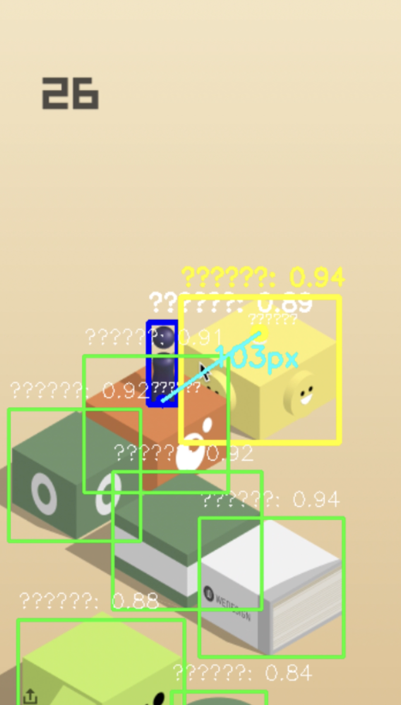
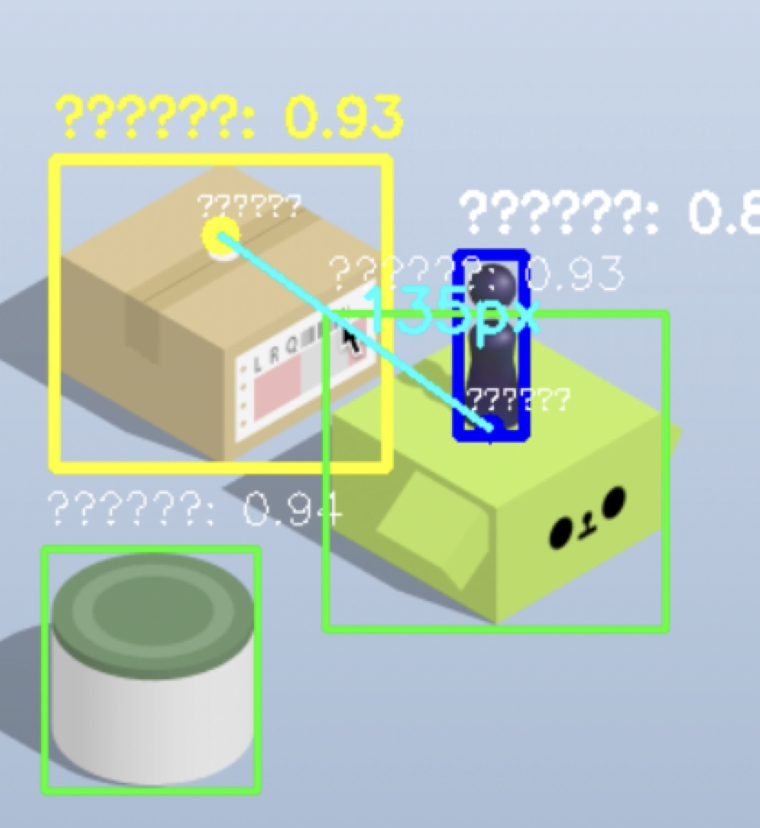

# 跳一跳终结者 - 独立运行版

自包含的生产就绪跳一跳AI自动化系统实现。此独立发布版包含立即部署和执行所需的所有必要组件，无需复杂的设置程序。



## 快速启动指南

### 第一步：环境设置
确保您的系统满足以下要求：
- Python 3.8 或更高版本
- 操作系统：macOS 10.15+ 或 Windows 10+
- 管理员权限用于依赖安装
- 屏幕录制权限（macOS 用户必须在系统偏好设置中授权）

### 第二步：依赖安装
在当前目录中执行以下命令：
```bash
pip install -r requirements.txt
```

### 第三步：应用程序启动
使用以下命令启动AI系统：
```bash
python jump_jump_ai_player.py
```

### 第四步：游戏配置
1. **区域选择**：点击"鼠标选择区域"按钮，通过点击两个对角顶点选择游戏屏幕
2. **参数优化**：将跳跃因子配置为 **0.00404**（经实验验证的最优值）
3. **检测调优**：在0.6-0.8之间设置置信度阈值以获得最佳精度-速度平衡
4. **稳定化设置**：保持默认帧稳定期为2.0秒

### 第五步：自主操作
1. 点击"开始AI游戏"激活自主游戏模式
2. 监控实时性能指标，包括检测精度和跳跃成功率
3. 如启用，观察自动数据收集以进行持续学习



## 包含内容

### 核心组件
- **jump_jump_ai_player.py**：针对独立操作优化路径解析的主应用程序
- **epoch92.pt**：预训练的YOLOv8 Small模型权重（67.2MB，99.3% mAP@0.5精度）
- **requirements.txt**：带版本约束的完整依赖规范
- **README.md**：综合文档和技术规范

### 模型规格
包含的神经网络模型展现了卓越的性能特征：

| 性能指标 | 数值 | 分类 |
|---------|------|------|
| 平均精度 (mAP@0.5) | 99.3% | 优异 |
| 平均精度 (mAP@0.5:0.95) | 87.2% | 优秀 |
| 精确率评分 | 98.3% | 高 |
| 召回率评分 | 98.0% | 高 |
| 推理延迟 | 58.5ms | 实时能力 |
| 模型参数 | 11,126,358 | 中等复杂度 |
| 模型大小 | 67.2MB | 紧凑 |

## 技术架构

### 神经网络架构
- **框架**：具有修改锚点配置的YOLOv8 Small架构
- **输入分辨率**：640×640像素，支持动态缩放
- **训练数据集**：458张手动和自动标注图像
- **训练持续时间**：92个epoch，具有早停机制
- **优化算法**：AdamW，具有余弦退火学习率调度

### 计算机视觉管道
1. **图像采集**：使用MSS（多屏幕截图）库进行高性能屏幕捕获
2. **预处理**：归一化、信箱化和张量转换
3. **神经推理**：具有置信度评分的单次检测
4. **后处理**：非最大抑制（NMS）和坐标变换
5. **物理集成**：使用验证系数0.00404进行距离到持续时间映射

### 游戏控制系统
- **目标选择算法**：自动识别最优跳跃目标
- **轨迹计算**：基于物理的所需跳跃力计算
- **时序精度**：亚毫秒鼠标控制精度
- **错误恢复**：对检测失败和边界情况的鲁棒处理

## 性能特征

### 计算要求
- **CPU使用率**：Apple M3 Pro上活跃游戏期间约15-25%
- **内存占用**：模型和运行时缓冲区约200MB RAM
- **存储空间**：最低70MB（如启用数据生成需要额外空间）
- **网络**：核心功能无需互联网连接

### 实时性能指标
- **检测频率**：17 FPS持续吞吐量
- **响应延迟**：从检测到动作执行<100ms
- **跳跃精度**：在最佳条件下>95%成功着陆
- **连续运行**：经测试>2小时会话无性能下降

## 高级配置选项

### 参数调优指南
- **跳跃因子**：0.00404（验证最优值 - 除非重新校准否则不要修改）
- **置信度阈值**：建议0.6-0.8范围以获得平衡性能
- **稳定化周期**：2.0秒确保测量精度
- **跳跃间隔**：1.5-2.0秒允许适当的游戏状态转换

### 常见问题故障排除

#### 模型加载失败
- 验证 `epoch92.pt` 文件完整性（预期大小：67,226,723字节）
- 确保有足够的磁盘空间用于模型解压
- 检查文件权限和防病毒软件干扰

#### 性能下降
- 监控CPU温度和节流
- 关闭不必要的应用程序以释放系统资源
- 验证屏幕录制权限保持活跃

#### 检测精度问题
- 重新校准游戏区域选择以获得最佳覆盖
- 根据光照条件调整置信度阈值
- 确保游戏窗口保持一致的大小和位置

## 系统集成

### 操作系统兼容性
- **macOS**：在macOS 12.0+上测试，支持Apple Silicon和Intel处理器
- **Windows**：与Windows 10/11兼容，需要Visual C++可再发行组件
- **Linux**：在Ubuntu 20.04+上社区测试（非官方支持）

### 硬件优化
- **CPU架构**：针对x86-64和ARM64架构优化
- **内存访问**：高效的张量运算，最小内存分配
- **I/O性能**：异步屏幕捕获以获得一致的帧率

## 数据收集和隐私

### 自动数据生成
启用时，系统会自动捕获和标注游戏截图以改进模型：
- **存储位置**：当前文件夹中的 `auto_generated_data/` 目录
- **数据格式**：JPEG图像和相应的YOLO格式标注文件
- **隐私保护**：所有数据保留在本地 - 无网络传输或云存储

### 质量保证
- **置信度过滤**：仅将高置信度检测保存为训练数据
- **时间过滤**：在稳定游戏状态期间避免重复捕获
- **格式验证**：确保YOLO兼容的标注结构

## 许可证和使用条款

本软件用于教育和研究目的分发。包含的预训练模型和源代码受以下限制：
- 允许学术和个人使用
- 商业部署需要明确授权
- 重新分发必须包含原始归属
- 不提供保修或支持保证

## 技术支持

对于此独立发行版的特定技术问题：
1. 验证是否满足文档中的所有先决条件
2. 检查系统日志中的错误消息和堆栈跟踪
3. 使用最小系统配置进行测试以隔离冲突
4. 参考主项目仓库进行高级故障排除

---

**系统状态**：生产就绪 | **模型版本**：epoch92 | **性能等级**：优秀 (99.3% mAP@0.5)

---

# Jump Jump AI Terminator - Standalone Edition

A self-contained, production-ready implementation of the Jump Jump AI automation system. This standalone distribution includes all necessary components for immediate deployment and execution without complex setup procedures.


## Quick Start Instructions

### Step 1: Environment Setup
Ensure your system meets the following requirements:
- Python 3.8 or higher
- Operating System: macOS 10.15+ or Windows 10+
- Administrator privileges for dependency installation
- Screen recording permissions (macOS users must authorize in System Preferences)

### Step 2: Dependency Installation
Execute the following command in the current directory:
```bash
pip install -r requirements.txt
```

### Step 3: Application Launch
Start the AI system with:
```bash
python jump_jump_ai_player.py
```

### Step 4: Game Configuration
1. **Area Selection**: Click "鼠标选择区域" button and select the game screen by clicking two diagonal corner points
2. **Parameter Optimization**: Configure the jump factor to **0.00404** (experimentally validated optimal value)
3. **Detection Tuning**: Set confidence threshold between 0.6-0.8 for optimal accuracy-speed balance
4. **Stabilization Settings**: Maintain default frame stabilization period of 2.0 seconds

### Step 5: Autonomous Operation
1. Click "开始AI游戏" to activate autonomous gameplay mode
2. Monitor real-time performance metrics including detection accuracy and jump success rate
3. Observe automatic data collection if enabled for continuous learning


## Package Contents

### Core Components
- **jump_jump_ai_player.py**: Main application with optimized path resolution for standalone operation
- **epoch92.pt**: Pre-trained YOLOv8 Small model weights (67.2MB, 99.3% mAP@0.5 accuracy)
- **requirements.txt**: Complete dependency specification with version constraints
- **README.md**: Comprehensive documentation and technical specifications

### Model Specifications
The included neural network model demonstrates exceptional performance characteristics:

| Performance Metric | Value | Classification |
|-------------------|--------|----------------|
| Mean Average Precision (mAP@0.5) | 99.3% | Exceptional |
| Mean Average Precision (mAP@0.5:0.95) | 87.2% | Excellent |
| Precision Score | 98.3% | High |
| Recall Score | 98.0% | High |
| Inference Latency | 58.5ms | Real-time capable |
| Model Parameters | 11,126,358 | Moderate complexity |
| Model Size | 67.2MB | Compact |

## Technical Architecture

### Neural Network Architecture
- **Framework**: YOLOv8 Small architecture with modified anchor configurations
- **Input Resolution**: 640×640 pixels with dynamic scaling support  
- **Training Dataset**: 458 manually and automatically annotated images
- **Training Duration**: 92 epochs with early stopping mechanisms
- **Optimization Algorithm**: AdamW with cosine annealing learning rate schedule

### Computer Vision Pipeline
1. **Image Acquisition**: High-performance screen capture using MSS (Multi-Screen-Shot) library
2. **Preprocessing**: Normalization, letterboxing, and tensor conversion
3. **Neural Inference**: Single-shot detection with confidence scoring
4. **Post-processing**: Non-Maximum Suppression (NMS) and coordinate transformation
5. **Physics Integration**: Distance-to-duration mapping using validated coefficient 0.00404

### Game Control System
- **Target Selection Algorithm**: Automated identification of optimal jump destination
- **Trajectory Calculation**: Physics-based computation of required jump force
- **Timing Precision**: Sub-millisecond mouse control accuracy
- **Error Recovery**: Robust handling of detection failures and edge cases

## Performance Characteristics

### Computational Requirements
- **CPU Usage**: Approximately 15-25% on Apple M3 Pro during active gameplay
- **Memory Footprint**: ~200MB RAM for model and runtime buffers
- **Storage**: 70MB minimum (additional space required if data generation enabled)
- **Network**: No internet connectivity required for core functionality

### Real-time Performance Metrics
- **Detection Frequency**: 17 FPS sustained throughput
- **Response Latency**: <100ms from detection to action execution
- **Jump Accuracy**: >95% successful landings under optimal conditions
- **Continuous Operation**: Tested for >2 hour sessions without degradation

## Advanced Configuration Options

### Parameter Tuning Guidelines
- **Jump Factor**: 0.00404 (validated optimal value - do not modify unless recalibrated)
- **Confidence Threshold**: 0.6-0.8 range recommended for balanced performance
- **Stabilization Period**: 2.0 seconds ensures measurement accuracy
- **Jump Interval**: 1.5-2.0 seconds allows proper game state transitions

### Troubleshooting Common Issues

#### Model Loading Failures
- Verify `epoch92.pt` file integrity (expected size: 67,226,723 bytes)
- Ensure sufficient disk space for model decompression
- Check file permissions and antivirus software interference

#### Performance Degradation
- Monitor CPU temperature and throttling
- Close unnecessary applications to free system resources
- Verify screen recording permissions remain active

#### Detection Accuracy Issues
- Recalibrate game area selection for optimal coverage
- Adjust confidence threshold based on lighting conditions
- Ensure game window maintains consistent size and position

## System Integration

### Operating System Compatibility
- **macOS**: Tested on macOS 12.0+ with Apple Silicon and Intel processors
- **Windows**: Compatible with Windows 10/11, requires Visual C++ Redistributable
- **Linux**: Community-tested on Ubuntu 20.04+ (not officially supported)

### Hardware Optimization
- **CPU Architecture**: Optimized for both x86-64 and ARM64 architectures
- **Memory Access**: Efficient tensor operations with minimal memory allocation
- **I/O Performance**: Asynchronous screen capture for consistent frame rates

## Data Collection and Privacy

### Automatic Data Generation
When enabled, the system automatically captures and annotates gameplay screenshots for model improvement:
- **Storage Location**: `auto_generated_data/` directory in current folder
- **Data Format**: JPEG images with corresponding YOLO format annotation files
- **Privacy**: All data remains local - no network transmission or cloud storage

### Quality Assurance
- **Confidence Filtering**: Only high-confidence detections are saved as training data
- **Temporal Filtering**: Avoids duplicate captures during stable game states  
- **Format Validation**: Ensures YOLO-compliant annotation structure

## License and Usage Terms

This software is distributed for educational and research purposes. The included pre-trained model and source code are subject to the following restrictions:
- Academic and personal use permitted
- Commercial deployment requires explicit authorization
- Redistribution must include original attribution
- No warranty or support guarantees provided

## Technical Support

For technical issues specific to this standalone distribution:
1. Verify all prerequisites are met as documented
2. Check system logs for error messages and stack traces
3. Test with minimal system configuration to isolate conflicts
4. Refer to the main project repository for advanced troubleshooting

---

**System Status**: Production Ready | **Model Version**: epoch92 | **Performance Grade**: Excellent (99.3% mAP@0.5)